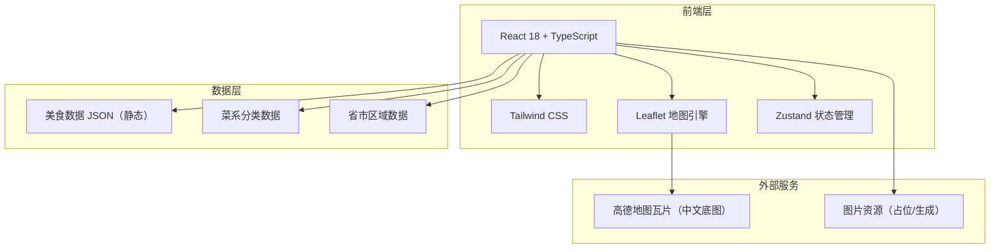
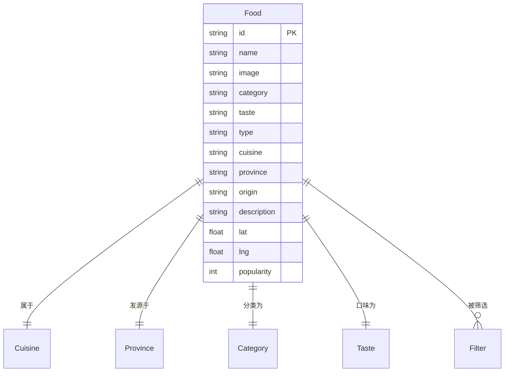

## 1. 架构设计



## 2. 技术说明

- **前端**：React@18 + TypeScript + tailwindcss@3 + vite
- **初始化工具**：vite-init（react-ts 模板）
- **地图引擎**：Leaflet@1.9 + react-leaflet@4（开源、轻量、支持中文瓦片）
- **底图瓦片**：高德地图瓦片服务（中文标注、详细地名、无 API Key 限制的标准瓦片）
- **状态管理**：Zustand（筛选状态、选中美食、面板开关）
- **后端**：无（纯前端应用，美食数据以静态 JSON 形式内嵌）
- **数据库**：无（使用静态 JSON 数据）

## 3. 路由定义

| 路由 | 用途 |
|------|------|
| `/` | 地图主页（唯一页面，所有交互在该页内完成） |

## 4. API 定义

本应用无后端 API，所有数据为前端静态 JSON。

### 4.1 美食数据结构（TypeScript 类型定义）

```typescript
// 美食分类
type FoodCategory = '主菜' | '小吃' | '甜品' | '糕点' | '面食' | '汤羹' | '饮品' | '腌制' | '其他';

// 美食类型
type FoodType = 'traditional' | 'popular';

// 口味
type Taste = '咸鲜' | '麻辣' | '酸甜' | '清淡' | '香甜' | '酸辣' | '苦香' | '复合';

// 菜系
type Cuisine =
  | '鲁菜' | '川菜' | '粤菜' | '苏菜'           // 四大菜系
  | '浙菜' | '闽菜' | '湘菜' | '徽菜'            // 八大菜系补充
  | '其他';

// 省份
type Province =
  | '北京' | '天津' | '河北' | '山西' | '内蒙古'
  | '辽宁' | '吉林' | '黑龙江'
  | '上海' | '江苏' | '浙江' | '安徽' | '福建' | '江西' | '山东'
  | '河南' | '湖北' | '湖南' | '广东' | '广西' | '海南'
  | '重庆' | '四川' | '贵州' | '云南' | '西藏'
  | '陕西' | '甘肃' | '青海' | '宁夏' | '新疆'
  | '香港' | '澳门' | '台湾';

interface Food {
  id: string;
  name: string;              // 美食名称
  image: string;             // 图片 URL
  category: FoodCategory;    // 分类
  taste: Taste;              // 口味
  type: FoodType;            // 传统 / 流行
  cuisine: Cuisine;          // 所属菜系
  province: Province;        // 发源省份
  origin: string;            // 发源地描述（含"传/据说"等不确定表述）
  description: string;       // 详细介绍
  lat: number;               // 纬度
  lng: number;               // 经度
  popularity?: number;       // 流行度（1-10，流行美食字段）
}
```

## 5. 服务器架构

本应用无后端服务器。

## 6. 数据模型

### 6.1 数据模型关系



### 6.2 数据初始化

数据以静态 JSON 文件形式存放在 `src/data/foods.json`，包含：

1. **四大菜系代表美食**（鲁、川、粤、苏）：每菜系 4-6 道，共约 20 道
2. **八大菜系补充美食**（浙、闽、湘、徽）：每菜系 3-5 道，共约 16 道
3. **34 省市自治区代表美食**：每省 2-4 道（与菜系代表美食可重叠），共约 80-100 道
4. **流行美食**：当下各地流行的美食约 20-30 道（如螺蛳粉、麻辣烫、奶茶、煎饼果子等）

总计约 120-150 道美食，每道含完整字段信息。
